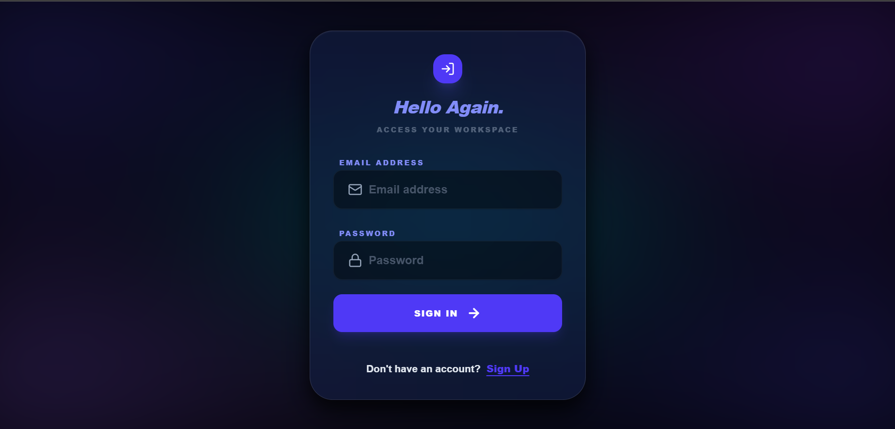
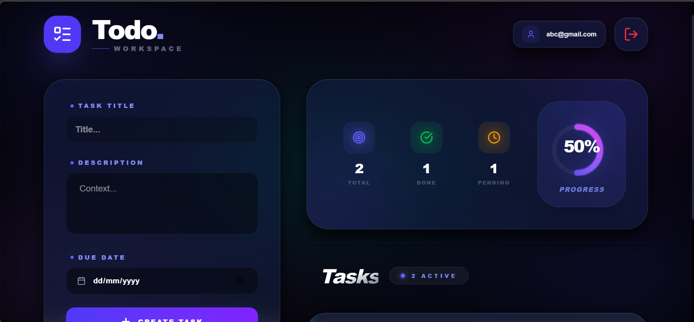
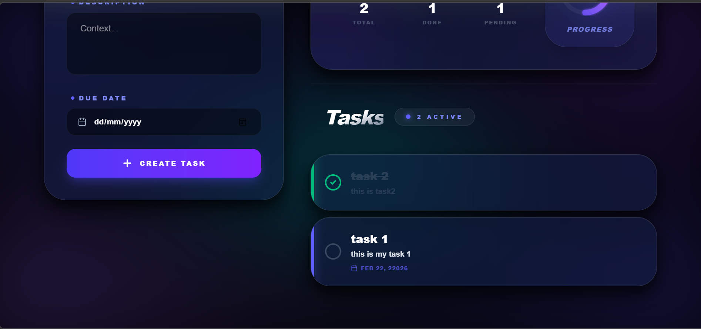

# ⚡ Premium MERN Todo App

[](https://reactjs.org/)
[](https://tailwindcss.com/)
[](https://nodejs.org/)
[](https://www.mongodb.com/)

A professional-grade, full-stack Task Management application featuring an ultra-modern **Glassmorphism** design, real-time analytics, and fluid animations. Built for performance and aesthetics.

---

## ✨ Key Features

- 💎 **Ultra-Modern UI:** Sophisticated Glassmorphism design with an interactive mesh background.
- 📊 **Real-time Dashboard:** Instant visualization of task progress with glowing analytics rings.
- 🚀 **Buttery Smooth Performance:** Optimized animations and hardware-accelerated transitions.
- 📱 **Responsive Design:** Two-column workspace optimized for both desktop and mobile power users.
- 🎉 **Completion Celebrations:** Interactive confetti effects when reaching 100% productivity.
- 🔒 **Secure Auth:** Built-in JWT-based authentication for private workspace management.

---

## 🛠️ Tech Stack

### **Frontend**
- **React 18** (Vite-powered for speed)
- **Redux Toolkit** (Reliable state synchronization)
- **Framer Motion** (Production-grade animations)
- **Tailwind CSS v4** (Advanced utility-first styling)
- **Lucide Icons** (Sleek, consistent iconography)

### **Backend**
- **Node.js & Express** (Scalable API architecture)
- **MongoDB** (Flexible document storage)
- **Mongoose** (Elegant object modeling)
- **JWT** (Modern authentication)

---

## 🚀 Getting Started

### 1. Prerequisite
- Node.js (v16+)
- MongoDB Atlas account or local MongoDB instance

### 2. Installation

Clone the repository:
```bash
git clone [your-repo-url]
cd task2-todo-app
```

Install Dependencies:
```bash
# Install Server dependencies
cd server
npm install

# Install Client dependencies
cd ../client
npm install
```

### 3. Environment Variables

Create a `.env` file in the `server` directory:
```env
PORT=5000
MONGODB_URI=your_mongodb_connection_string
JWT_SECRET=your_super_secret_key
```

### 4. Running the Application

Open two terminals:

**Terminal 1: Backend**
```bash
cd server
npm run dev
```

**Terminal 2: Frontend**
```bash
cd client
npm run dev
```

The app will be available at `http://localhost:5173`.

---

## 🎨 Design Philosophy

This app isn't just a todo list; it's a workspace designed to inspire productivity. We focus on:
- **Depth:** Using multiple shadow layers and inner glows to create a 3D interface.
- **Vibrancy:** Curated indigo-to-purple gradients that signify high energy.
- **Focus:** Removing clutter (like unnecessary search bars) to keep the user focused on the tasks at hand.

---

## Screenshots

Below are screenshots showing the system interface and functionality.

### Landing Page


### Authentication Page


### Task Management Page




## 📄 License

Distributed under the MIT License. See `LICENSE` for more information.

---

👨‍💻 Author

Built with ❤️ by [Wasat Ullah Khan]
